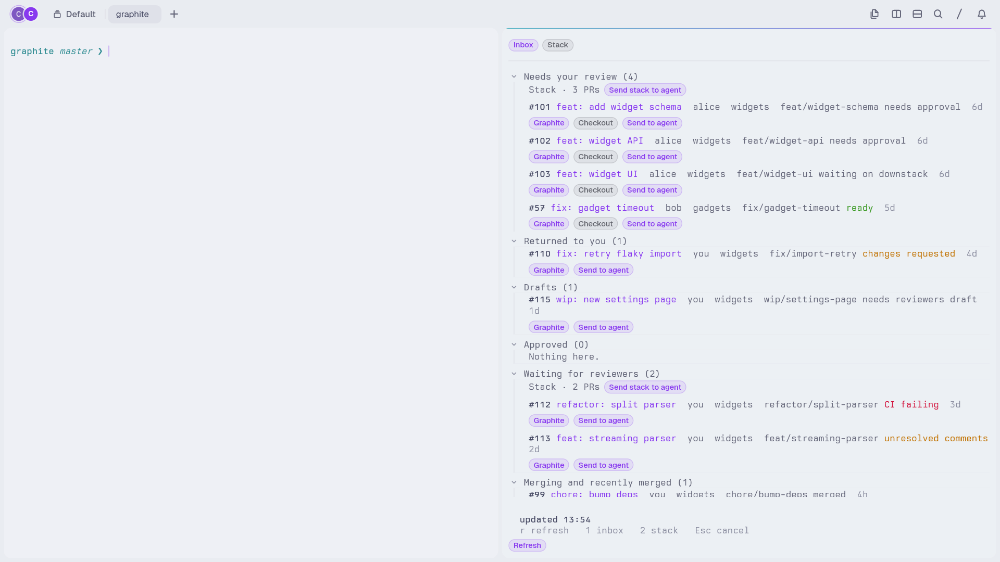
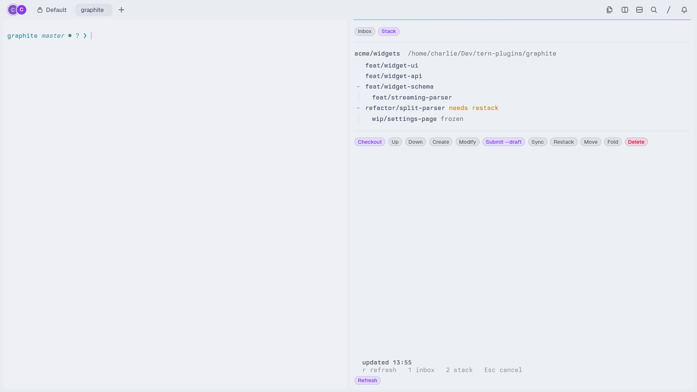
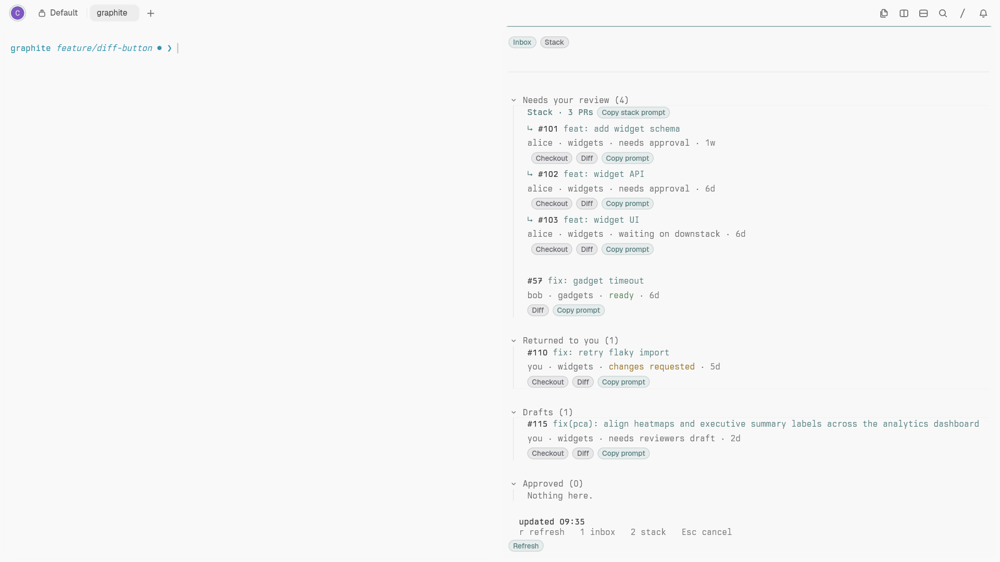

# graphite

[](https://github.com/charliemartin0/tern-graphite/actions/workflows/ci.yml)
[](LICENSE)

A Tern window plugin that shows your [Graphite](https://graphite.dev) PR inbox
and the current repo's Graphite stack.
It signs in through the Graphite CLI's own login (`gt auth`) — no browser
cookie, no `gh` — and mirrors the inbox sections your Graphite account is
configured to show, with a merge-status badge on every row.




## Requirements

- Tern 0.6.0 or newer.
- The Graphite CLI (`gt`), signed in via `gt auth`. See [Sign in](#sign-in).
- `git` on `PATH` (Checkout creates worktrees with it).
- Optional: the GitHub CLI (`gh`) for unresolved-comment counts; the
  [pr-tour](#diff) plugin for the **Diff** button.

`gt`, `tern` and `gh` are found with `command -v` in your login shell; set
`gt_path` / `tern_path` / `gh_path` in the [config](#config) if they live
somewhere your login shell doesn't see.

## What it does

- **Inbox tab** (default): the same sections, in the same order, as your
  Graphite inbox (`Needs your review`, `Returned to you`, `Drafts`, `Approved`,
  `Waiting for reviewers`, `Merging and recently merged`, …), each with its
  count. Data comes from the Graphite API
  (`GET /graphite/sections-summary`, `POST /graphite/cli/pull-request-info`,
  `POST /graphite/mergeability-status`), read-only. PRs that share a Graphite
  stack are grouped together with a **Send stack to agent** button; standalone
  PRs follow.
- **Each row** shows the PR number and clickable title first, followed by a
  configurable metadata line (author, repo, branch, status, age). By default
  the title gets its own line and the branch is hidden; long titles wrap rather
  than being truncated.
- **Row actions**: check out into a fresh git worktree (for any open PR with a
  branch — yours or others'; an existing worktree at the configured path is
  reused); **Copy prompt** / **Send to agent** (see `send_mode`; yours and
  others'). The clickable title opens the PR in Graphite.
- Pull-request detail status overrides stale section-summary status; completed
  PRs still listed in `Drafts` are omitted. Merged and closed rows show only
  their lifecycle status, not mergeability labels.
- Merge-status requests are batched at 25 PRs to avoid Graphite rejecting
  large inboxes with HTTP 413. If detail or merge-status enrichment fails,
  the inbox still updates and the footer shows `partial fetch: <reason>`;
  an updated timestamp confirms the inbox list was fetched, not that every
  enrichment request succeeded.
- **Comment counts**: rows whose merge status is `changes requested` or
  `unresolved comments` show an unresolved review-thread count fetched via the
  `gh` CLI (optional; the inbox renders without it). The count is available as
  `{comments}` in prompt templates.
- **Stack tab**: the focused repo's stack from `gt log short` (including the
  branch you are on), rendered as a tree, with the common `gt` actions
  (checkout, up, down, create, modify, submit --draft, sync, restack, move,
  fold, delete with confirm). Interactive commands open in a normal Tern pane.
  If `gt` prints a worktree name ending in `pr<number>` or `pr-<number>` next
  to a branch (e.g. `(pr-123)`, `(myrepo-pr123)`), it is shown as `#123`.
- **Sign-in card**: if you are not signed in (or your token is rejected), the
  block shows a card with a button to open the Graphite sign-in page and a
  button to open a terminal, so you can run the `gt auth --token …` command the
  page shows.

## Sign in

The block uses the `gt` CLI's own login, resolved the same way `gt` resolves it:
the `GRAPHITE_AUTH_TOKEN` env var, else the named profile's token
(`GRAPHITE_PROFILE`, else `user_config.profile`, else the `"default"` profile)
in `~/.config/graphite/auth`, else `auth.authToken`, else
`user_config.authToken`. To sign in:

```sh
gt auth        # prints "Authenticated as: <login>" once signed in
```

If `gt auth` says you are not authenticated, run `gt auth --web` (or open
`https://app.graphite.com/activate` and paste the `gt auth --token …` command
it shows). The block picks the token up on the next refresh — no cookie, no `gh`.

## Config

On first open the block creates `config.json` in Tern's plugin data dir for
`graphite` — on Linux `~/.local/state/tern/plugin-data/graphite/config.json`
(next to `kv.json`). It is read on every refresh, so edits apply on the next
poll. Unknown/missing/wrong-type keys fall back to their default; invalid JSON
falls back to all defaults and surfaces the error in the dock.

| Key                  | Default                                                                  | Notes |
|----------------------|--------------------------------------------------------------------------|-------|
| `poll_seconds`        | `120`                                                                    | Inbox poll interval; clamped to ≥ 30. |
| `max_prs_per_section` | `50`                                                                     | `first=` sent to sections-summary; clamped to 1..100. |
| `hidden_sections`     | `[]`                                                                     | Section names to hide (case-insensitive exact match). Hidden sections still count toward the status badge if they normally would. |
| `agent_patterns`      | `["omp","claude","codex","aider","gemini","opencode"]`                 | Lowercased substrings matched against a pane's title/program to flag it as an agent pane. Used only if every entry is a string. |
| `pr_title_first`       | `true`                                                                   | Put the PR title on its own first line; `false` appends the configured metadata fields inline after the title. |
| `pr_metadata_fields`   | `["author","repo","status","age"]`                                      | Metadata fields to display, in order. Allowed: `author`, `repo`, `branch`, `status`, `age`. Add `branch` to show it; `[]` hides all metadata. |
| `pr_branch_max_chars`  | `36`                                                                     | Maximum displayed branch length when `branch` is included; long names are middle-truncated. Clamped to 12..120. |
| `show_checkout_button` | `true`                                                                  | Show the per-PR **Checkout** button in the inbox. `false` hides it and the checkout action is rejected. Does not affect the stack tab's `gt checkout`. |
| `show_diff_button`     | `true`                                                                  | Show the per-PR **Diff** button in the inbox. Opens the PR in the `pr-tour` plugin (`pr-tour.tour`) in a new tab; works for every PR, no local checkout. `false` hides it and the diff action is rejected. The button is also hidden while the pr-tour plugin isn't detected. |
| `diff_open`            | `"tab"`                                                                 | Where the **Diff** button opens the tour: `"tab"` (new tab), `"beside"` or `"below"` (a block next to the focused pane). Other values fall back to `"tab"`. |
| `worktree_dir`        | `".gt-worktrees"`                                                        | Subdir under the repo for checkout worktrees. Used only when `worktree_path` is empty (legacy). |
| `worktree_path`       | `""`                                                                     | Template for the checkout worktree path. Empty → legacy `{repo_root}/{worktree_dir}/{branch}`. When set, substitutes `{repo_root}`, `{repo}`, `{branch}`, `{number}` and expands a leading `~` — e.g. `"{repo_root}/../{repo}-pr{number}"` or `"~/worktrees/{repo}-pr{number}"`. |
| `gt_path`             | `""`                                                                     | Absolute path to `gt`; empty → resolve via `command -v gt`. |
| `tern_path`           | `""`                                                                     | Absolute path to `tern`; empty → resolve via `command -v tern`. |
| `gh_path`             | `""`                                                                     | Absolute path to `gh`; empty → resolve via `command -v gh`. `gh` is optional — used only for unresolved-comment counts; the inbox works without it. |
| `send_mode`           | `"clipboard"`                                                            | What the send buttons do. `"clipboard"` copies the rendered prompt (buttons read **Copy prompt** / **Copy stack prompt**); `"pane"` opens the pane picker (buttons read **Send to agent** / **Send stack to agent**). Any other value falls back to `"clipboard"`. |
| `send_submit_default` | `false`                                                                  | Initial state of the send picker's submit toggle in `pane` mode: `false` = paste only (review before sending), `true` = paste + Enter. |
| `transition_toast`    | `false`                                                                  | Toast when a PR newly appears in "Needs your review" or "Returned to you". |
| `prompts.review`       | `"Review PR #{number} {title} {url}. Don't post comments, just tell me in chat"` | Sent for someone else's PR. |
| `prompts.address`      | `"Address the requested changes on PR #{number} {url}"`                 | Sent for your own PR. |
| `prompts.stack_line`   | `"PR #{number} {title} {url}"`                                           | One line per PR in a stack prompt. |
| `prompts.review_stack` | `"Review this stack (bottom to top):\n{prs}\nDon't post comments, just tell me in chat"` | Stack of others' PRs. |
| `prompts.address_stack` | `"Address this stack (bottom to top):\n{prs}"`                          | Stack of your own PRs. |

Prompt templates substitute `{name}` with `number`, `title`, `url`, `author`,
`branch`, `repo`, `comments` (unresolved review-thread count, `"0"` when not
fetched) per PR, and `prs` (the joined `stack_line` lines, for stack prompts).
Unknown `{name}` is left as-is; `%` in values is safe.

## Send to agent

`send_mode` selects what the send buttons do. The default, `"clipboard"`, copies
the rendered prompt to the clipboard so you can paste it into any agent; it does
not depend on pane detection. Set `"send_mode": "pane"` for the picker below.

In `pane` mode **Send to agent** lists live panes via `tern ls --json`, flags a pane as an agent
pane when its lowercased title or program contains any lowercased
`agent_patterns` entry, defaults to the most recently focused agent pane (else
the focused pane), and pastes the rendered prompt with
`tern send <pane> paste`. A **Submit: paste only / paste + Enter** toggle in the
picker controls whether Enter is then pressed (`tern send <pane> keys enter`);
paste only is the default, so you can review the prompt before sending.

## Checkout

**Checkout** creates a git worktree for the PR's head branch and opens a pane in
it. It works for others' PRs **and your own** (the main case for addressing
review comments). The worktree location follows `worktree_path` when set, else
the legacy `{repo_root}/{worktree_dir}/{branch}` layout. An existing worktree at
that path is reused.

The legacy layout puts worktrees inside the repo, where git reports
`.gt-worktrees/` as untracked. Either add it to `.git/info/exclude` or set
`worktree_path` to a location outside the repo.

## Diff

The **Diff** badge opens the PR in the `pr-tour` plugin (an AI-guided tour of
the diff) in a new tab, or as a block beside/below the focused pane with
`diff_open`. It is an optional integration: `pr-tour` is a separate plugin that
is not part of this repository, and until it is linked into the same Tern
install (`tern plugin link <path-to-pr-tour>`) the button is **hidden
entirely**. The window half checks the host's block types on start and every
30 s, so the button appears within about 30 s of linking and the next inbox
render. The host half can't create blocks, so it opens a
`tern-graphite://diff/<base64url json>` link that the window half claims with
`tern.route.link`.



## Keys

`r` refresh · `1` inbox · `2` stack · `Esc` cancel a confirm / send picker.

## Install

```sh
git clone https://github.com/charliemartin0/tern-graphite.git
cd tern-graphite
tern plugin link .
```

Linking loads the plugin into the daemon and existing windows; no Tern restart
is needed. Run `tern plugin types .` to regenerate `tern.d.luau` after a Tern
SDK update. Open the block with the **Open graphite** palette command (action
`plugin.graphite.open`); the status line shows `graphite <n>` (n = PRs in your
counted sections, warning tone when > 0) and opens the block on click.

## Known limitations

These were confirmed against Tern 0.6.0 and shape how the plugin works:

1. **A plugin block runs on the host (daemon) half.** `BlockCx` has
   `toast`/`open`/`copy` and `render`, but **no** `session`/`agents`/`run`/
   `layout` — those are `WindowCx`-only. So the block cannot enumerate panes,
   focus a pane, or type into one through the in-process window API. There is no
   block→window event bridge. ⇒ Every window-manipulating row action (send to
   agent, check out, open a pane for an interactive `gt` command) shells out to
   the `tern` CLI (`tern ls`, `tern send`, `tern split`).
2. **`tern` CLI commands default to the first window.** A plugin-spawned process
   has no `TERN_WINDOW_KEY`, so `tern ls` / `tern send` / `tern split` target
   "the first window". With a single Tern window this is correct; with multiple
   windows open the block in the first one.
3. **`tern shot` does not load plugins.** Screenshots are taken by opening a
   real Tern window (with `--control` for verification) and capturing it with
   `grim`.
4. **No CLI to invoke a palette action or open a plugin block.** Tests open the
   block through a `GRAPHITE_AUTOOPEN` env var consumed by the window half's
   `window_start` hook (dev only, no effect in normal use).

## Contributing and testing

CI compiles every module with Luau and runs the unit tests on each push and pull
request. The same checks locally, with the [Luau CLI](https://github.com/luau-lang/luau/releases)
(CI pins 0.741):

```sh
luau-compile --null config.luau graphite.luau common.luau host.luau window.luau
luau test/unit.luau   # gt log short parser, worktree path expansion
```

Fixture JSON lives in `test/fixtures` (synthetic: `check_auth.json`,
`sections_summary.json`, `pull_request_info.json`, `mergeability_status.json`,
`gt_log_short.txt`). The block's `fixture` mode reads those instead of calling
the network, so the renderer is deterministic.

Render checks and screenshots need a real Tern window. `GRAPHITE_AUTOOPEN` is a
development-only switch (`fixture`, `fixture-stack`, `fixture-signedout`,
`live`) that opens the block automatically when a window starts; it has no
effect in normal use. `window_start` fires once per plugin per window, so it
only triggers on a fresh window in a daemon that hasn't already opened
graphite.

```sh
GRAPHITE_AUTOOPEN=fixture tern --control /tmp/win.sock . &
sleep 6   # float the window and resize it to 1536x864 (1920x1080 at scale 1.25)
tern ctl --control /tmp/win.sock shot inbox && cp target/shots/tern/live/inbox.png test/screenshots/
tern ctl --control /tmp/win.sock quit
# Stack tab: GRAPHITE_AUTOOPEN=fixture-stack, shot name `stack`.
# Signed-out card: GRAPHITE_AUTOOPEN=fixture-signedout, then `tern ctl ... a11y`.
# Live (signed in through gt only): GRAPHITE_AUTOOPEN=live tern --control /tmp/win.sock /path/to/your/repo
```

Saved shots live in `test/screenshots/` (fixture mode). Do not commit a live
screenshot — it shows your real PRs.

`test/checkout_scope.sh` is the end-to-end regression for the Checkout, Diff and
send buttons. It links this checkout into a private Tern config, starts its own
daemon with isolated state (your plugin links and config are untouched), opens a
fixture window and counts the rendered badges. It needs `tern` and `jq`:

```sh
bash test/checkout_scope.sh
SHOW_CHECKOUT=false bash test/checkout_scope.sh   # expects zero Checkout badges
SHOW_DIFF=false bash test/checkout_scope.sh       # expects zero Diff badges
SEND_MODE=pane bash test/checkout_scope.sh        # expects "Send to agent" labels
PR_TOUR=absent bash test/checkout_scope.sh        # pr-tour not linked: zero Diff badges
PR_TOUR_DIR=/path/to/pr-tour bash test/checkout_scope.sh   # default: ../pr-tour
```

## License

[MIT](LICENSE).
